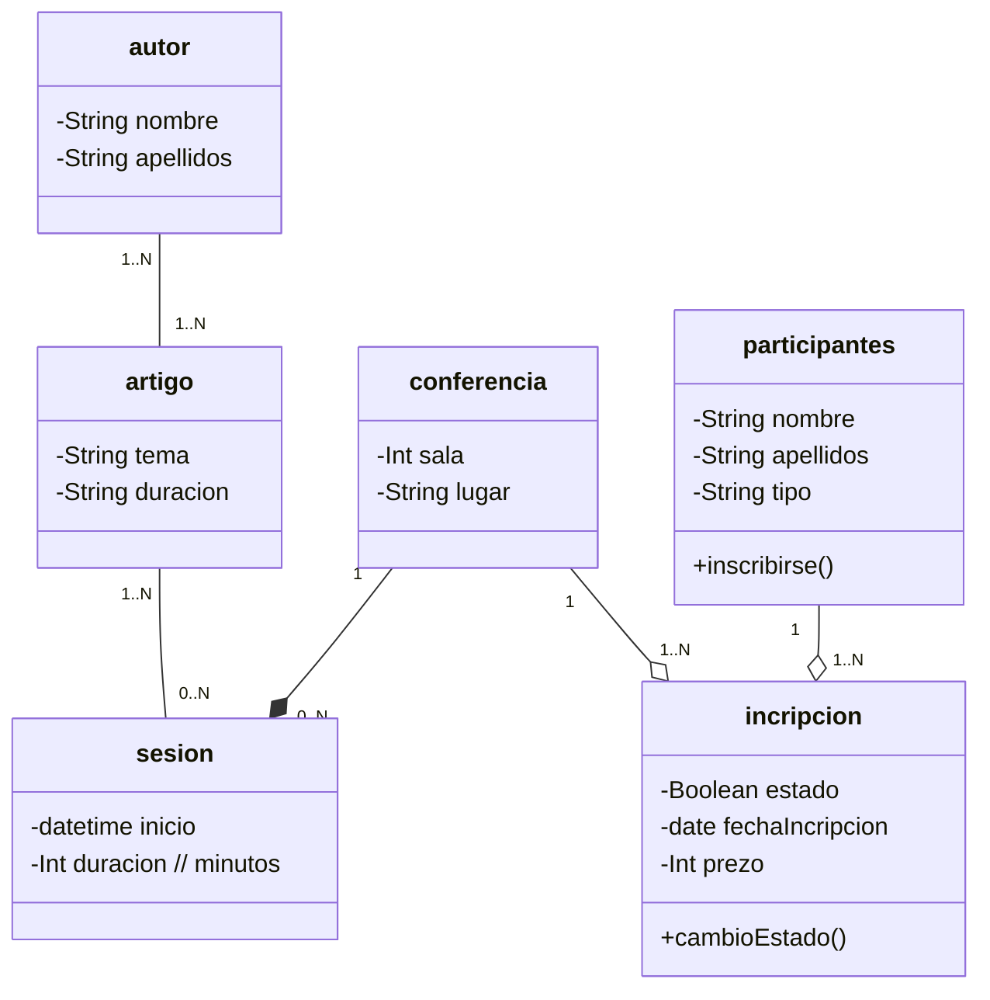

1. Breve descripción del proceso realizado.

Empezamos creando no diagrama as clases de conferencia
 e sesion asignandolle unha relacion de cardinalidad 

- conferencia a sesion 0..N
- sesion a conferencia sin derteminar

Tras leer o segundo punto no diagrama actualizamos a
 relacion de asociacion a unha composicion e ca 
seguinte cardinalidade. Aqui se determinan alguns atributos
como data e hora de inicio na clase sesion

- conferencia a sesion 0..N
- sesion a conferencia 1

Tras leer o terceiro punto añadense as clases participante
e inscripcion por un momento pensouse nunha generalización, 
pero non consideramos atributos propios votando un vistazo
 aos seguintes puntos así que non a fixemos. Aqui xa se
determinan alguns atributos coma tipo (orador/publico) en participantes e 
un metodo en inscripcion chamado cambioEstado (confirmado/cancelado)

O primer caso de cardinalidade que trataremos e entre participante
 e inscripcion. Entendemos que un participante pode estar incripto en varias conferencias

- inscripcion a participante 1
- participante a inscripcion 1..N

A segunda caso de cadinalidade que trataremos e entre inscripcion e
 conferencia
- inscripcion a conferencia 1
- conferencia a inscripcion 1..N

Nota: consideramos que aqui existe unha relación de agregación porque consideramos que 
existe un todo e logo unha parte

No cuarto punto añadimos unha nova clase chamada artigos e creamos 
unha asociación con sesion e a clase artigo ten o atributo duracion (curto/longo).
A cardinalidade entre artigo e sesion e a seguinte
- artigo a sesion 0..N //suposto
- sesion a artigo 1..N

No quinto punto añadimos unha nova clase que e autor máis a sua cardinalidade.
Supomos que o autor vai ter como minimo 1 artigo para ser un autor
e un artigo poder ter varios 1 ou mais autores

- autor a artigo 1..N
- artigo a autor 1..N

No sexto punto añadimos algun que outro atributo extra sobre os indicados nos puntos previos que consideramos como se podra ver no punto 2 co codigo fonte ou no propio
codigo java

2. Código fuente del diagrama anotado en sus etiquetas.




3. Código java de las clases.
``` Java
public class Artigo {
   private String tema;
   private String duracion;

   public Artigo() {
   }

   public Artigo(String duracion, String tema) {
   this.duracion = duracion;
   this.tema = tema;
   }

   public String getDuracion() {
   return duracion;
   }

   public void setDuracion(String duracion) {
   this.duracion = duracion;
   }

   public String getTema() {
   return tema;
   }

   public void setTema(String tema) {
   this.tema = tema;
   }

   @Override
   public String toString() {
   return "Artigo{" +
   "duracion='" + duracion + '\'' +
   ", tema='" + tema + '\'' +
   '}';
   }
   }

import java.util.List;

public class Participantes {
    private String nombre;
    private String apellidos;
    private String tipo;
    private List<Inscripcion> inscripcions;

    public Participantes() {
    }

    public Participantes(String nombre, String apellidos, String tipo, List<Inscripcion> inscripcions) {
        this.nombre = nombre;
        this.apellidos = apellidos;
        this.tipo = tipo;
        this.inscripcions = inscripcions;
    }

    public String getNombre() {
        return nombre;
    }

    public void setNombre(String nombre) {
        this.nombre = nombre;
    }

    public String getApellidos() {
        return apellidos;
    }

    public void setApellidos(String apellidos) {
        this.apellidos = apellidos;
    }

    public String getTipo() {
        return tipo;
    }

    public void setTipo(String tipo) {
        this.tipo = tipo;
    }

    public List<Inscripcion> getInscripcions() {
        return inscripcions;
    }

    public void setInscripcions(List<Inscripcion> inscripcions) {
        this.inscripcions = inscripcions;
    }

    @Override
    public String toString() {
        return "Participantes{" +
                "nombre='" + nombre + '\'' +
                ", apellidos='" + apellidos + '\'' +
                ", tipo='" + tipo + '\'' +
                ", inscripcions=" + inscripcions +
                '}';
    }

    public void inscribirse(){

    }
}


import java.util.List;

public class Conferencia {
    private Integer sala;
    private String lugar;
    private List<Sesion> sesiones;
    private List<Inscripcion> inscripcions;

    public Conferencia() {
    }

    public Conferencia(Integer sala, String lugar, List<Sesion> sesiones, List<Inscripcion> inscripcions) {
        this.sala = sala;
        this.lugar = lugar;
        this.sesiones = sesiones;
        this.inscripcions = inscripcions;
    }

    public Integer getSala() {
        return sala;
    }

    public void setSala(Integer sala) {
        this.sala = sala;
    }

    public String getLugar() {
        return lugar;
    }

    public void setLugar(String lugar) {
        this.lugar = lugar;
    }

    public List<Sesion> getSesiones() {
        return sesiones;
    }

    public void setSesiones(List<Sesion> sesiones) {
        this.sesiones = sesiones;
    }

    public List<Inscripcion> getInscripcions() {
        return inscripcions;
    }

    public void setInscripcions(List<Inscripcion> inscripcions) {
        this.inscripcions = inscripcions;
    }

    @Override
    public String toString() {
        return "Conferencia{" +
                "sala=" + sala +
                ", lugar='" + lugar + '\'' +
                ", sesiones=" + sesiones +
                ", inscripcions=" + inscripcions +
                '}';
    }
}


import java.util.Date;

public class Inscripcion {
    private Boolean estado;
    private Date fechaInscripcion;
    private Integer prezo;

    public Inscripcion() {
    }

    public Inscripcion(Boolean estado, Date fechaInscripcion, Integer prezo) {
        this.estado = estado;
        this.fechaInscripcion = fechaInscripcion;
        this.prezo = prezo;
    }

    public Boolean getEstado() {
        return estado;
    }

    public void setEstado(Boolean estado) {
        this.estado = estado;
    }

    public Date getFechaInscripcion() {
        return fechaInscripcion;
    }

    public void setFechaInscripcion(Date fechaInscripcion) {
        this.fechaInscripcion = fechaInscripcion;
    }

    public Integer getPrezo() {
        return prezo;
    }

    public void setPrezo(Integer prezo) {
        this.prezo = prezo;
    }

    @Override
    public String toString() {
        return "Inscripcion{" +
                "estado=" + estado +
                ", fechaInscripcion=" + fechaInscripcion +
                ", prezo=" + prezo +
                '}';
    }
    public void cambioEstado(){

    }
}


import java.sql.Time;
import java.util.Date;
import java.util.List;

public class Sesion {
    private Date inicio_dia;
    private Time inicio_hora;
    private List<Artigo> artigo;

    public Sesion() {
    }

    public Sesion(Date inicio_dia, Time inicio_hora, List<Artigo> artigo) {
        this.inicio_dia = inicio_dia;
        this.inicio_hora = inicio_hora;
        this.artigo = artigo;
    }

    public Date getInicio_dia() {
        return inicio_dia;
    }

    public void setInicio_dia(Date inicio_dia) {
        this.inicio_dia = inicio_dia;
    }

    public Time getInicio_hora() {
        return inicio_hora;
    }

    public void setInicio_hora(Time inicio_hora) {
        this.inicio_hora = inicio_hora;
    }

    public List<Artigo> getArtigo() {
        return artigo;
    }

    public void setArtigo(List<Artigo> artigo) {
        this.artigo = artigo;
    }

    @Override
    public String toString() {
        return "Sesion{" +
                "inicio_dia=" + inicio_dia +
                ", inicio_hora=" + inicio_hora +
                ", artigo=" + artigo +
                '}';
    }


}


import java.util.List;

public class Autor {
    private String nombre;
    private String apellidos;
    private List<Artigo> artigo;

    public Autor() {
    }

    public Autor(String apellidos, List<Artigo> artigo, String nombre) {
        this.apellidos = apellidos;
        this.artigo = artigo;
        this.nombre = nombre;
    }

    public String getApellidos() {
        return apellidos;
    }

    public void setApellidos(String apellidos) {
        this.apellidos = apellidos;
    }

    public List<Artigo> getArtigo() {
        return artigo;
    }

    public void setArtigo(List<Artigo> artigo) {
        this.artigo = artigo;
    }

    public String getNombre() {
        return nombre;
    }

    public void setNombre(String nombre) {
        this.nombre = nombre;
    }

    @Override
    public String toString() {
        return "Autor{" +
                "apellidos='" + apellidos + '\'' +
                ", nombre='" + nombre + '\'' +
                ", artigo=" + artigo +
                '}';
    }
}

```

